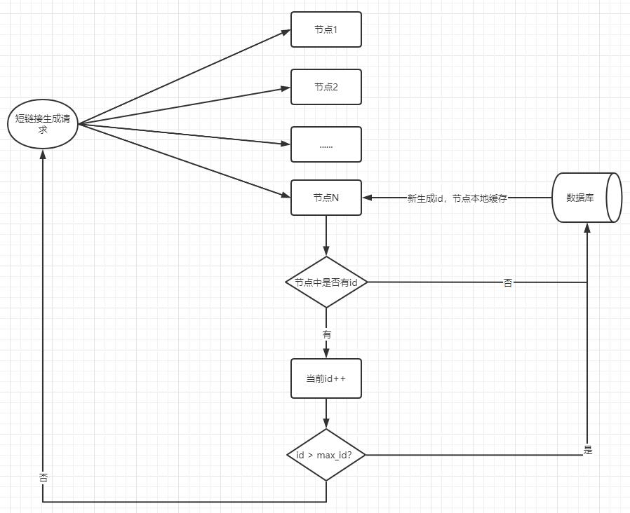

# wave项目后台开发

## wave-user 用户系统设计
- [x] 账号分库  

- [x] 用户信息分库

- [x] 好友关注：关注与被关注

## wave-blog 帖子中心设计
- [x] 帖子分库

分库思路
> 基因分库法，采用uid分库，取uid % n ^ 2 作为分库索引号，tid = x bit + n bit 形成tid，
>查询时，通过tid查时，则需要 tid % n ^ 2 取出后n bit位，定位到库，然后再根据tid查到数据。
>实践时，可预留n的最大值为4，则表示以后blog库拓展的最大值是 2^4=16个库，即最大只能分配16个库。
>前期可先分配4个库(n=2)，则分库规则为 `tid % 16 % 4` 得到的数值即为库号，后续看数据量可增加到8、16，通过双写将数据刷到库.

扩展性
> 暂时采用双写方式扩展，即当数据量增长到一定程度时，通过重新加大n的值，重新分库。

- [x] 帖子信息

- [ ] 首页热帖

- [x] 好友帖子
sharding jdbc 如何完成in参数的跨库  
sharding jdbc 如何完成跨库表分页？

- [x] 关注好友的帖子

新增帖子时，更新粉丝的"动态"列表。

- [ ] ES同步

## wave-url 短链接系统设计
帖子链接设计
  

统计功能

## wave-search 搜索组件设计
数据同步：增量 MQ / cannal

帖子搜索

用户搜索

## wave-trx 分布式事务设计

## wave-admin 运营层设计
大量数据查看：同步spark

## wave-gate 网关

## wave-file 分布式文件

zk一致性使用，用于协调文件读写

uploadurl 申请、授权 -> 上传 -> 返回读链接

## wave-demo 技术应用demo

## api设计
### 如何识别用户
wave-gate网关层实现用户认证，转发请求时header加入user等身份识别

### API安全

